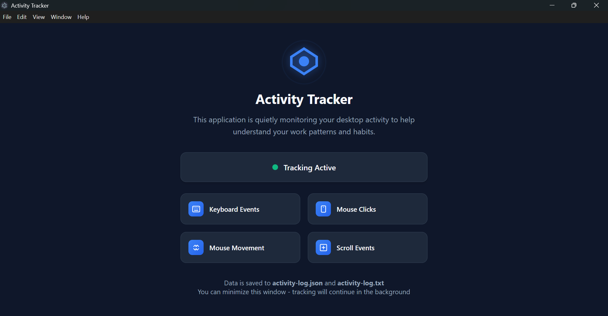
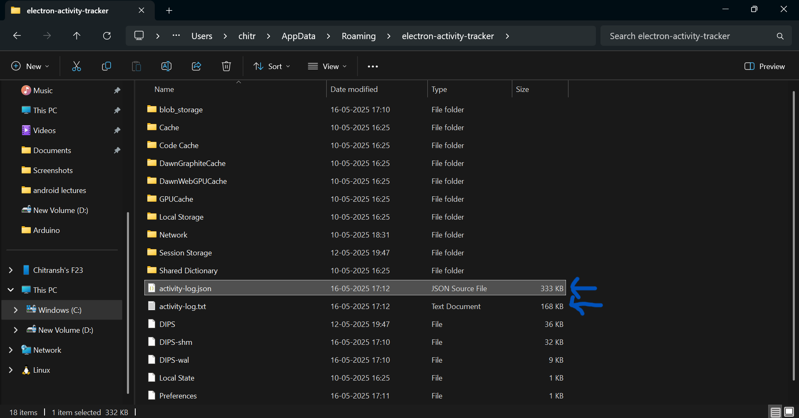

# Electron Activity Tracker

This is a desktop application built with Electron that tracks user activity like active window title, mouse, and keyboard inputs, and logs the data locally.

---
## 🖼️ Screenshot





---
## 🖥️ Features

- Tracks active window titles and usage duration
- Monitors keyboard and mouse activity using `uiohook-napi` and `robotjs`
- Saves logs with timestamps
- Automatically runs in the background when started
- Clean and minimal UI
- Stores data in the system's app data directory (`AppData/Roaming/electron-activity-tracker` on Windows)

---

## 📁 Output Location

On Windows, logs are stored in:
```

C:\Users\<YourUsername>\AppData\Roaming\electron-activity-tracker

````

---

## 📦 Tech Stack

- [Electron](https://www.electronjs.org/)
- [uiohook-napi](https://www.npmjs.com/package/uiohook-napi)
- [active-win](https://www.npmjs.com/package/active-win)
- [robotjs](https://www.npmjs.com/package/robotjs)
- [Node.js](https://nodejs.org/en)

---

## 🚀 Build Setup

To run the app in development:

```bash
npm install
npm start
````

To build the app for Windows:

```bash
npm run dist
```

---

